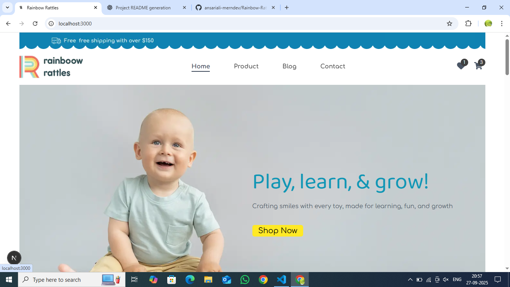
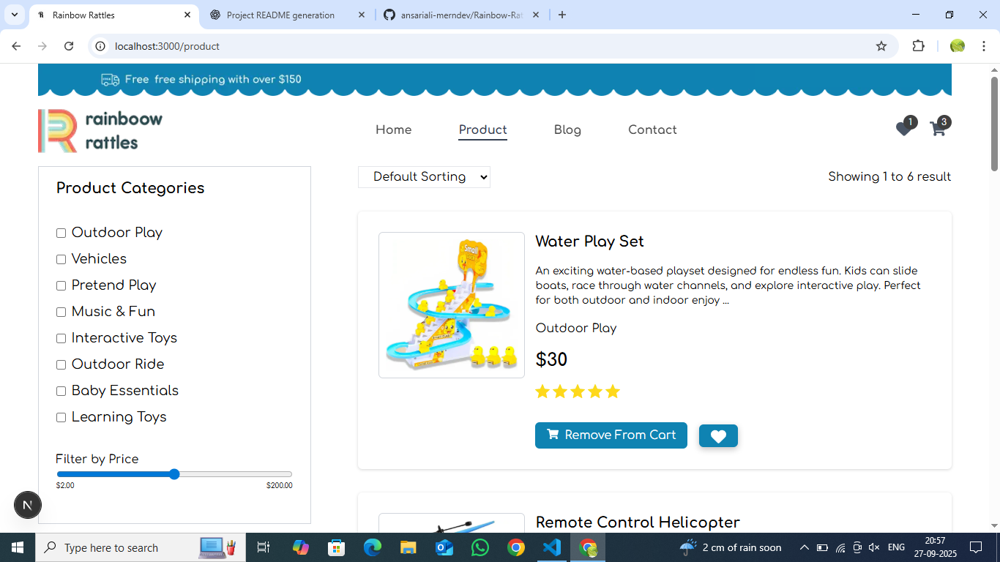
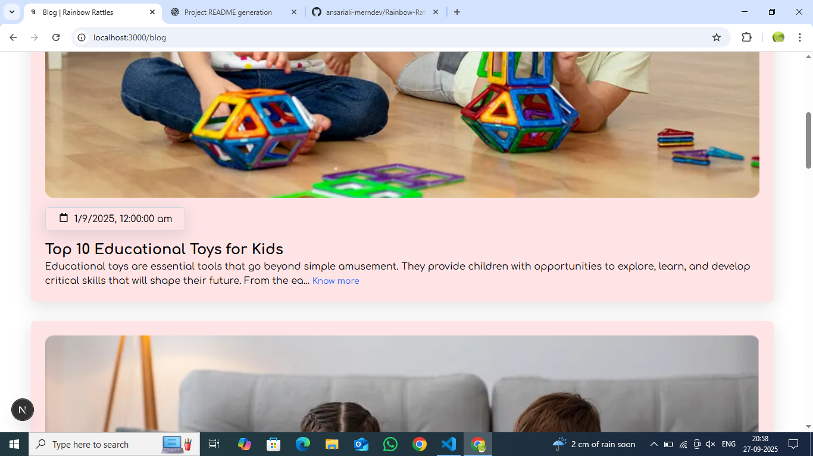
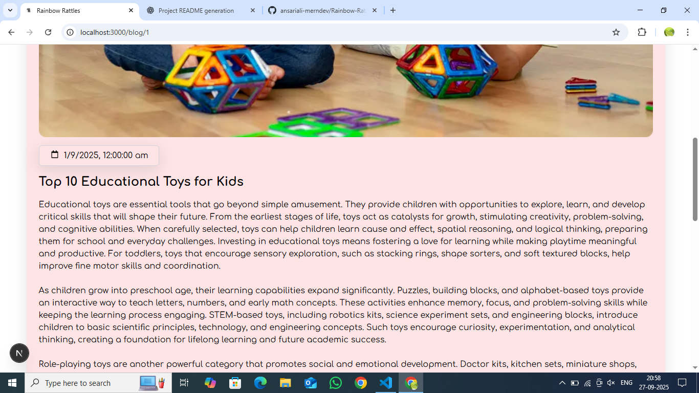
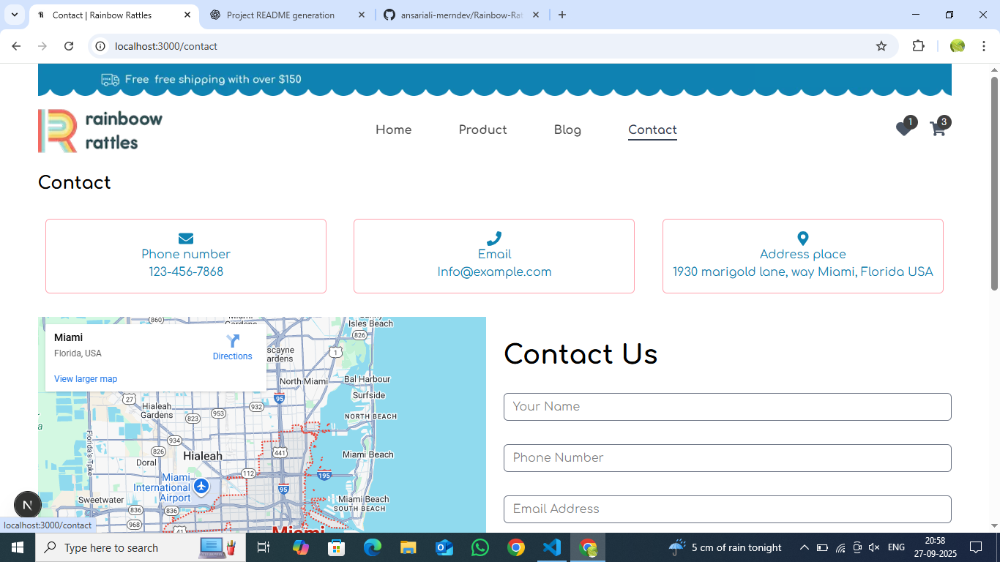
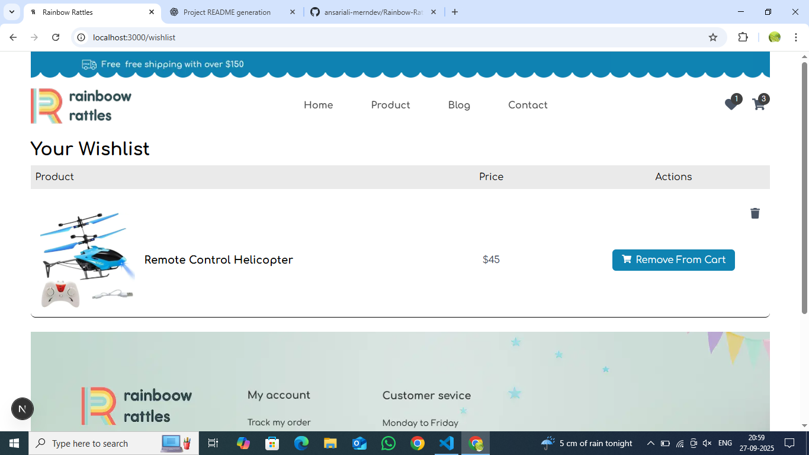
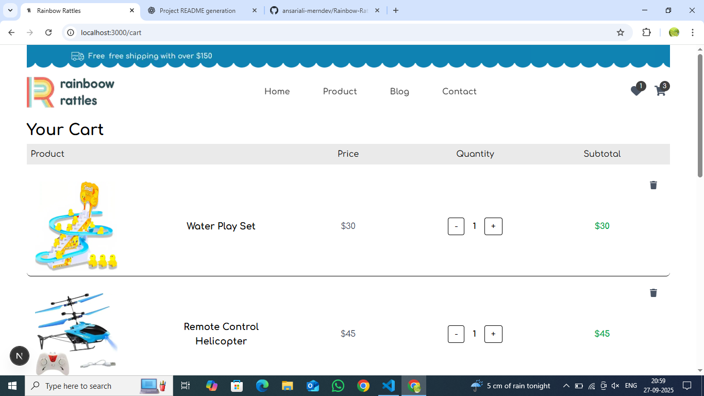

# 🌈 Rainbow Rattles

**Rainbow Rattles** is a responsive e-commerce website built with **Next.js**, featuring both SSR (Server-Side Rendering) and CSR (Client-Side Rendering). It allows users to browse products, filter & sort them, read blogs, manage a cart & wishlist, and contact the store.

---

## 🚀 Features

### Home Page
- Clean and responsive UI  
- Highlighted featured products  
- Smooth navigation across pages  



### Product Page
- Filter products by category  
- Sort products by price (Low → High, High → Low)  
- Pagination support for large product lists  



### Blog Page
- List of blogs with **"Know More"** navigation to detailed blog pages  
- Clean blog listing and detail views  




### Contact Page
- Simple contact form for user inquiries  


### Cart & Wishlist
- Add, remove, and view items  
- Data saved in **localStorage**  
- Alerts using **SweetAlert2**  





### Additional Features
- Uses **React Icons** for UI enhancements  
- **Swiper.js** for carousel/slider components  
- Fully responsive design  
- Smooth UX with client-side interactions  

---

## 🛠 Tech Stack

| Feature                  | Technology / Library                  |
|---------------------------|--------------------------------------|
| Frontend Framework        | Next.js 15 (SSR & CSR)               |
| Styling                   | Tailwind CSS 4                        |
| State Management          | Redux Toolkit + React Redux           |
| Alerts / Notifications    | SweetAlert2                          |
| Icons                     | React Icons                          |
| Carousel / Slider         | Swiper.js 12                          |
| Type Safety               | TypeScript 5                          |

---

## 📦 Installation

1. Clone the repository:

```bash
git clone https://github.com/yourusername/rainbow_rattles.git
cd rainbow_rattles
